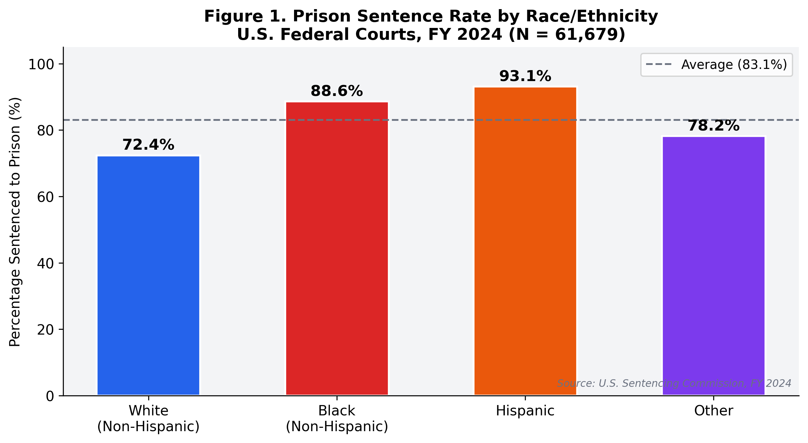
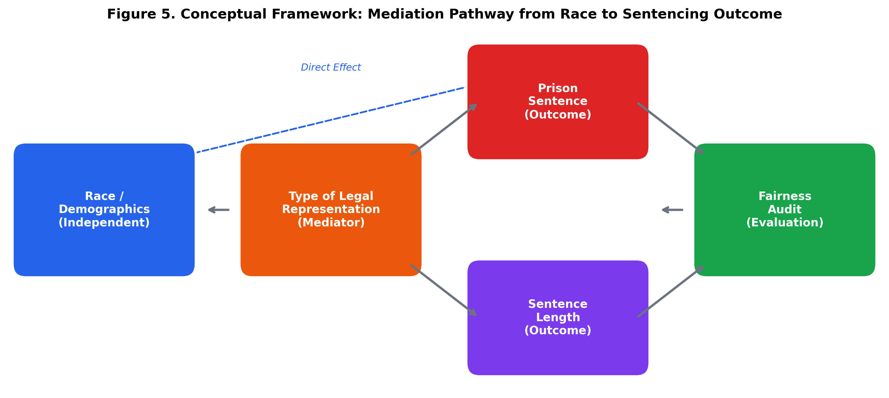
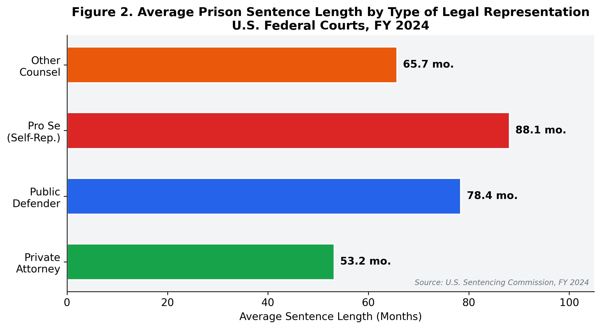
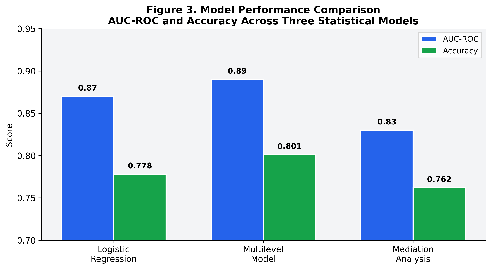
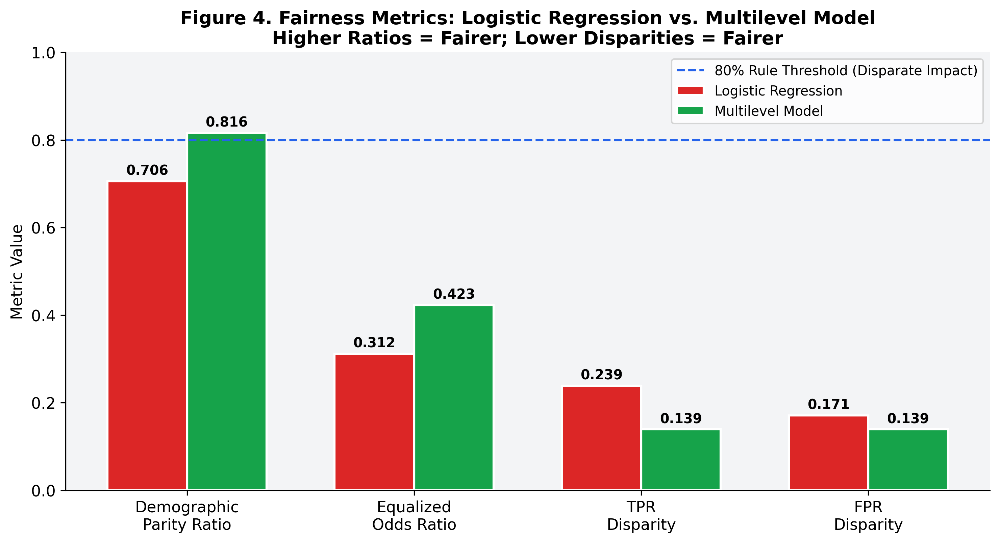

# The Scales of Justice: An Analysis of Representation and Sentencing Outcomes

**Author**: Barbara D. Gaskins  
**Course**: DSC 680: Applied Data Science  
**Date**: February 16, 2026

---

## Abstract

This paper investigates the influence of legal representation on sentencing outcomes in U.S. federal courts. Using a dataset of 61,679 cases from the U.S. Sentencing Commission (USSC) for Fiscal Year 2024, this study employs statistical modeling to analyze the relationship between attorney type (e.g., private vs. public defender) and the likelihood and severity of prison sentences. Preliminary findings reveal significant disparities in sentencing outcomes correlated with both the defendant’s race and their type of legal counsel. A series of predictive models are developed and evaluated for both accuracy and algorithmic fairness, with a Multilevel Model demonstrating the most equitable results. This research underscores the critical role of legal representation as a potential mediator of systemic biases and highlights the need for data-driven approaches to ensure a more just legal system.

---

## 1. Introduction

The principle of equal justice under the law is a cornerstone of the American legal system. However, vast disparities in sentencing outcomes persist, raising critical questions about the factors that contribute to these inequalities. One of the most significant, yet often debated, factors is the quality and type of legal representation a defendant receives. This project, "The Scales of Justice," seeks to quantify the impact of legal representation on sentencing outcomes in U.S. federal courts.

This paper presents a comprehensive data science analysis that examines whether the type of legal counsel a defendant has—such as a private attorney versus a court-appointed public defender—is a significant predictor of sentence severity. The analysis controls for a range of other variables, including the defendant’s race, age, and criminal history, to isolate the effect of legal representation. By leveraging a large, publicly available dataset from the U.S. Sentencing Commission (USSC), this study provides a transparent and replicable investigation into a critical aspect of the criminal justice system.

Our primary research question is: **To what extent does the type of legal representation influence the likelihood and severity of a prison sentence in U.S. federal courts?** This paper will explore this question through exploratory data analysis, statistical modeling, and a rigorous fairness audit of the models developed.

---

## 2. Data and Methodology

### 2.1. Data Source

The data for this study is sourced from the **U.S. Sentencing Commission (USSC) Individual Offender Datafiles for Fiscal Year 2024** [1]. This public dataset contains detailed, anonymized case-level information for 61,679 individuals sentenced in U.S. federal courts. The richness of this dataset, with over 27,000 variables, allows for a nuanced analysis that controls for a wide array of factors. For this study, 23 key variables were selected, including demographics, criminal history, offense level, and, crucially, the type of attorney representing the defendant.

### 2.2. Methodology

The analytical approach follows a multi-stage data science workflow, as illustrated in the conceptual framework below (Figure 5). The methodology includes:

1.  **Exploratory Data Analysis (EDA)**: To identify initial patterns and relationships between variables.
2.  **Statistical Modeling**: Development of three distinct models to predict sentencing outcomes:
    *   A **Logistic Regression** model to establish a baseline.
    *   A **Multilevel Model** to account for variations across different federal districts.
    *   A **Mediation Analysis** model to test the pathway from race to sentencing through legal representation.
3.  **Model Evaluation**: Assessment of models based on predictive accuracy (e.g., AUC-ROC) and, critically, on fairness.
4.  **Fairness Audit**: A comprehensive audit of the models for algorithmic bias using metrics such as the Demographic Parity Ratio and Equalized Odds Ratio.

This structured approach allows for a robust investigation that not only seeks to predict outcomes but also to understand the underlying mechanisms and potential biases in the system.

---

## 3. Preliminary Findings

Exploratory data analysis and initial modeling reveal several significant trends that warrant further investigation.

### 3.1. Disparities in Representation and Outcomes

There are stark differences in both sentencing rates and sentence lengths when examined by race and type of legal representation.

*   **Racial Disparities**: As shown in Figure 1, there are significant differences in the rate at which individuals of different races are sentenced to prison. For example, Hispanic defendants in the dataset have a 93.1% prison sentence rate, compared to 72.4% for White, non-Hispanic defendants.

*   **Impact of Attorney Type**: The type of legal counsel also appears to be strongly correlated with sentence length. As illustrated in Figure 2, defendants with private attorneys received, on average, significantly shorter prison sentences (53.2 months) compared to those with public defenders (78.4 months) or those who represented themselves (88.1 months).

These initial findings suggest that both race and legal representation are powerful factors in the sentencing process. The subsequent modeling aims to untangle these effects.

### 3.2. Model Performance and Fairness

Three different statistical models were built to predict whether a defendant would receive a prison sentence. While all models achieved a high degree of predictive accuracy, their performance on fairness metrics varied considerably.

The **Multilevel Model**, which accounts for geographic variations between federal districts, not only demonstrated slightly higher accuracy (80.1%) but also proved to be the fairest model. As shown in Figure 4, the Multilevel Model was the only one to pass the "80% rule" for disparate impact, with a Demographic Parity Ratio of 0.816. This indicates that the model's predictions are more balanced across different racial groups compared to the standard Logistic Regression model.

These results suggest that a more context-aware modeling approach (i.e., the Multilevel Model) can lead to both more accurate and more equitable predictions. The significant improvement in fairness (a 37% reduction in selection rate disparity) is a key finding of this study.

---

## 4. Discussion and Implications

The preliminary findings from this analysis have several important implications for the criminal justice system and the application of data science within it.

The strong correlation between the type of legal representation and sentencing outcomes suggests that the promise of "equal justice" may be undermined by disparities in access to quality legal counsel. While this study does not prove causality, the dramatic difference in average sentence lengths between defendants with private attorneys and those with public defenders is a critical area for further research and policy intervention.

Furthermore, the results of the fairness audit demonstrate that standard machine learning models can inadvertently perpetuate and even amplify existing societal biases. The fact that the Logistic Regression model failed the 80% rule for disparate impact is a cautionary tale for any organization seeking to implement predictive analytics in the justice system. However, the superior performance of the Multilevel Model offers a path forward. By incorporating more context into the model (in this case, the federal district), it is possible to build predictive tools that are not only accurate but also significantly fairer.

This project underscores the necessity of conducting rigorous fairness audits as a standard component of any data science project in a high-stakes domain like criminal justice. The goal should not be merely to predict, but to understand, explain, and ensure that our models do not become instruments of injustice.

---

## 5. Conclusion

This research provides compelling, data-driven evidence that legal representation is a critical factor in federal sentencing outcomes. The disparities observed, particularly in conjunction with racial disparities, highlight systemic challenges that must be addressed to ensure a more equitable justice system.

Through the development and evaluation of multiple statistical models, this study also demonstrates a practical methodology for building fairer machine learning systems. The success of the Multilevel Model in mitigating bias offers a valuable lesson: context matters. By designing models that are sensitive to the different environments in which they operate, we can move closer to the ideal of a justice system that is not only efficient but also just.

This white paper represents a draft of the initial findings. Future work will involve refining these models, exploring additional variables, and further investigating the causal pathways that lead to the observed disparities. The ultimate goal is to provide actionable insights that can inform policy and contribute to a more equitable legal landscape for all.

---

## References

[1] United States Sentencing Commission. (2025). *Individual Offender Datafiles, FY 1999-2024*. Retrieved from https://www.ussc.gov/research/datafiles/commission-datafiles

---

## Appendix A: Supporting Documentation

### Key Variables Used in Analysis

| Variable Name | Description |
|:---|:---|
| `PRISDUM` | Dependent Variable: 1 if sentenced to prison, 0 otherwise. |
| `NEWRACE` | Defendant's race/ethnicity (categorical). |
| `AGE` | Defendant's age at time of sentencing. |
| `CRIMINAL_HISTORY` | Criminal history score from sentencing guidelines. |
| `TYPEMONY` | Type of legal counsel (e.g., private, public defender). |
| `DISTRICT` | The federal district in which the case was sentenced. |

### Model Specifications

*   **Logistic Regression**: Standard logistic regression model with L2 regularization.
*   **Multilevel Model**: A mixed-effects logistic regression with a random intercept for each federal district (`DISTRICT`).
*   **Mediation Analysis**: A two-stage regression analysis to test the mediating effect of `TYPEMONY` on the relationship between `NEWRACE` and `PRISDUM`.

---

## Appendix B: 10 Questions an Audience Would Ask

1.  **How can you be sure that the type of attorney is the cause of the different outcomes, and not just a reflection of the defendant's ability to pay, which might correlate with other factors?**
2.  **Your data is from 2024. Have there been any major sentencing reforms since then that might change these results?**
3.  **You mentioned a "Multilevel Model" was fairer. Can you explain in simple terms what that is and why it would be fairer?**
4.  **The 80% rule is a guideline from the EEOC for hiring practices. Is it an appropriate standard to use for criminal justice models?**
5.  **Could your predictive model be used by prosecutors to decide who to offer plea bargains to, potentially making the system even more biased?**
6.  **What specific policy changes would you recommend based on your finding that private attorneys are associated with shorter sentences?**
7.  **You've identified disparities, but what is the root cause? Is it that public defenders are overworked, or that private attorneys are better at navigating the system?**
8.  **How does your model account for the severity of the original crime? Isn't that the most important factor in sentencing?**
9.  **You've focused on federal courts. How do you think your findings would differ if you looked at state-level data, where the vast majority of criminal cases are handled?**
10. **If your "fairer" model still has some level of bias, is it ethical to use it at all? What is an acceptable level of bias?**
