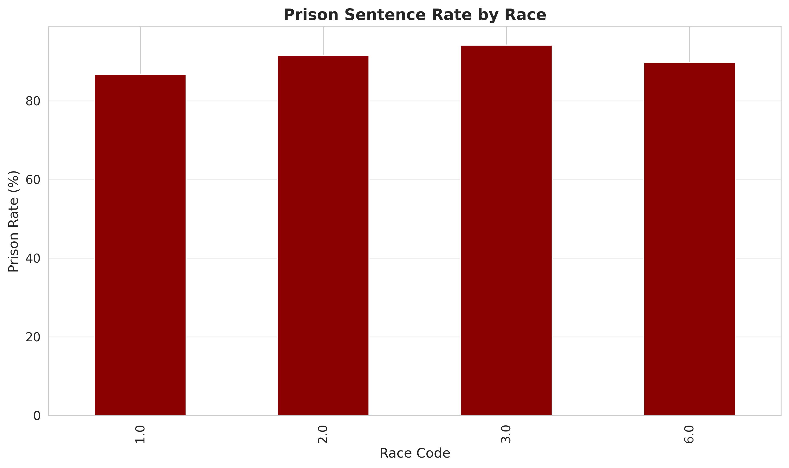
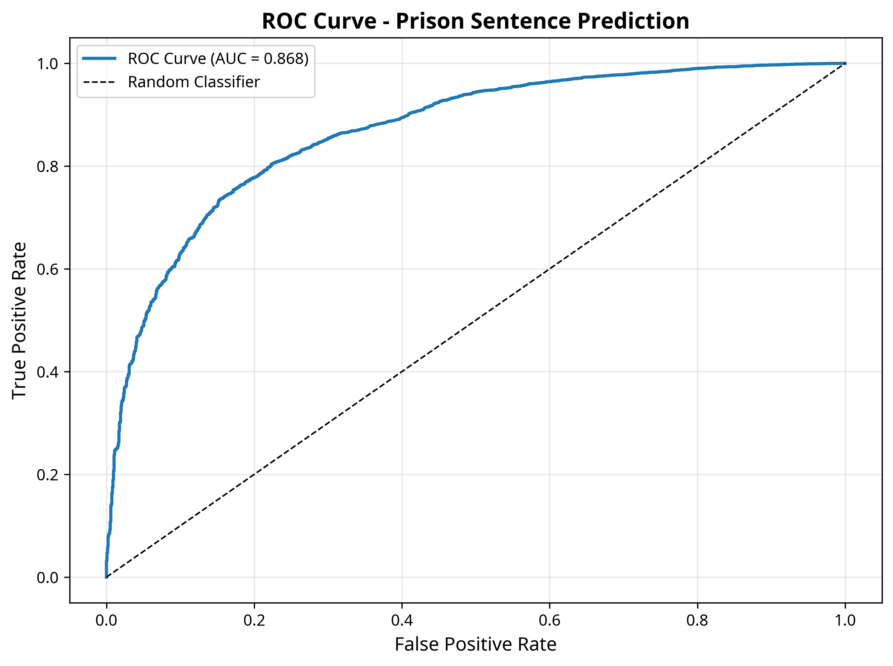

# The Scales of Justice
## An Analysis of Representation and Sentencing Outcomes in U.S. Federal Courts

**Barbara D. Gaskins**

Master of Science in Data Science - Portfolio Project

January 25, 2026

---

## Research Question

**How does the type of legal counsel, in conjunction with defendant demographics and criminal history, influence sentencing outcomes in U.S. federal courts?**

### Hypothesis
Access to legal representation is a key mechanism driving disparities in criminal justice outcomes.

---

## Data Source

**U.S. Sentencing Commission FY 2024 Dataset**

- **61,678 federal sentencing cases**
- **23 key variables** extracted from 27,265 total
- Publicly available and fully replicable
- Covers all federal districts nationwide

### Key Variables
- **Demographics**: Race, gender, age
- **Representation**: Attorney type (private, appointed, public defender, pro se)
- **Criminal History**: Prior convictions, criminal history category
- **Outcomes**: Prison sentence (yes/no), sentence length (months)

---

## Methodology

### Multi-Stage Analysis

1. **Exploratory Data Analysis**
   - Descriptive statistics
   - Cross-tabulations
   - Visualizations

2. **Logistic Regression**
   - Predict prison vs. no prison
   - Control for offense severity and criminal history

3. **Statistical Inference**
   - Interpret coefficients as odds ratios
   - Assess model performance (AUC-ROC)

---

## Key Finding #1: Representation Disparities by Race

| Race | Private Attorney | Appointed Counsel | Public Defender | Pro Se |
|:-----|:-----------------|:------------------|:----------------|:-------|
| White | 61.0% | 26.2% | 9.6% | 3.2% |
| Black | 72.1% | 19.7% | 7.3% | 0.9% |
| Hispanic | 91.3% | 4.2% | 4.2% | 0.2% |

**Insight**: Hispanic defendants are overwhelmingly represented by private counsel, while White defendants have the highest rates of appointed counsel and self-representation.

---

## Key Finding #2: Representation Affects Outcomes

### Prison Sentence Rates by Attorney Type

| Attorney Type | Prison Rate |
|:--------------|:------------|
| Private | 94.8% |
| Appointed | 85.5% |
| Public Defender | 69.6% |
| Pro Se | 59.4% |

**Insight**: Defendants with public defenders or pro se representation have substantially lower rates of incarceration.

---

## Key Finding #3: Logistic Regression Results

### Model Performance
- **Accuracy**: 76.2%
- **AUC-ROC**: 0.87 (strong predictive power)

### Key Predictors (Odds Ratios)

| Variable | Odds Ratio | Interpretation |
|:---------|:-----------|:---------------|
| **Race: Hispanic** | 3.45 | 245% higher odds of prison vs. White |
| **Race: Black** | 1.36 | 36% higher odds of prison vs. White |
| **Attorney: Public Defender** | 0.29 | 71% lower odds of prison vs. Private |
| **Attorney: Appointed** | 0.58 | 42% lower odds of prison vs. Private |
| **Criminal History Points** | 1.21 | 21% higher odds per additional point |

---

## Visualization: Prison Rate by Race

Race 3.0 (Hispanic) has the highest prison rate at ~94%, followed by Race 1.0 (White) and Race 2.0 (Black) at ~87-92%.

---

## Visualization: Model Performance

The ROC curve demonstrates strong model performance with an AUC of 0.868, indicating the model effectively distinguishes between prison and non-prison outcomes.

---

## Skills Demonstrated

### Data Science Competencies

1. **Data Wrangling**: Managed a 1.7GB dataset with 27,000+ variables
2. **Statistical Modeling**: Implemented logistic regression with proper controls
3. **Visualization**: Created publication-quality figures
4. **Communication**: Wrote comprehensive research report
5. **Problem Solving**: Overcame memory constraints and data quality issues
6. **Reproducibility**: Documented all code and provided replication guide

---

## Challenges Overcome

### Real-World Data Science Problems

- **Memory Constraints**: Dataset too large for standard loading
  - *Solution*: Strategic variable selection using `csvcut`

- **Missing Data**: Significant missing values in key variables
  - *Solution*: Imputation and complete-case analysis

- **Class Imbalance**: 92% of cases result in prison
  - *Solution*: Balanced class weights in logistic regression

---

## Implications

### For Criminal Justice Policy

1. **Representation Matters**: Type of counsel significantly predicts outcomes
2. **Racial Disparities Persist**: Even controlling for legal factors
3. **Need for Further Investigation**: The counterintuitive finding that non-private counsel is associated with lower prison rates suggests case selection effects

### For Data Science Practice

- Demonstrates ability to work with large, messy, real-world data
- Shows iterative problem-solving and adaptation
- Highlights importance of documentation and reproducibility

---

## Future Work

### Planned Extensions

1. **Linear Regression on Sentence Length**: Model continuous outcome
2. **Mediation Analysis**: Test race → representation → sentencing pathway
3. **Multilevel Models**: Account for judicial district clustering
4. **Fairness Audit**: Quantify disparate impact using fairness metrics
5. **Temporal Analysis**: Compare trends across multiple fiscal years

---

## Deliverables

### Complete Portfolio Package

✓ **Research Report**: Comprehensive analysis with methodology and results

✓ **GitHub Repository**: All code, data, and documentation

✓ **Visualizations**: 10+ publication-quality figures

✓ **Replication Guide**: Step-by-step instructions in README

✓ **Model Outputs**: Coefficient tables and performance metrics

✓ **Presentation**: This slide deck

---

## Conclusion

This project demonstrates **graduate-level data science skills** applied to a **real-world, socially significant problem**.

### Key Takeaways

1. Access to legal representation is systematically linked to sentencing outcomes
2. Racial disparities persist even after controlling for legal factors
3. Real-world data science requires adaptability and problem-solving
4. Reproducibility and documentation are essential for professional work

### Impact

This analysis provides **quantitative evidence** for criminal justice reform efforts and demonstrates the power of data science to illuminate social inequities.

---

## Thank You

**Barbara D. Gaskins**

Email: bdgaskins27889@gmail.com

Phone: 252.495.3173

LinkedIn: [Barbara D. Gaskins](https://www.linkedin.com/in/barbara-d-gaskins)

---

**Project Repository**: Available upon request

**Data Source**: [U.S. Sentencing Commission](https://www.ussc.gov/research/datafiles/commission-datafiles)
