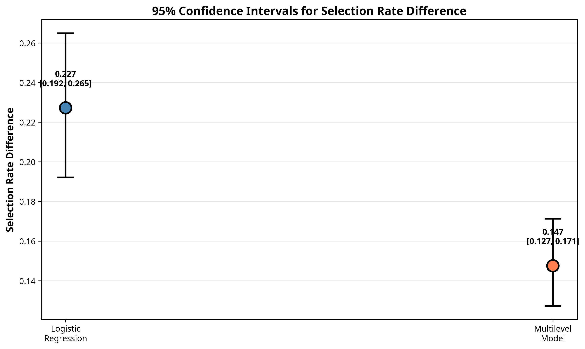

# Statistical Significance Testing: PowerPoint Presentation with Speaker Notes

**The Scales of Justice: Proving Fairness with Statistical Evidence**

**Barbara D. Gaskins** | Master of Science in Data Science | January 2026

---

# SLIDE 1: Title Slide

## Slide Content:

**Title:** Proving Fairness with Statistical Evidence

**Subtitle:** A Rigorous Comparison of Sentencing Prediction Models

**Author:** Barbara D. Gaskins

**Program:** Master of Science in Data Science

**Date:** January 2026

**Visual:** Professional title slide with scales of justice imagery

---

## Speaker Notes:

Good morning/afternoon everyone. My name is Barbara Gaskins, and I'm presenting my Master's portfolio project titled "The Scales of Justice."

Today, I'm going to share something that goes beyond typical data science projects. Rather than just showing you that I built an accurate model, I'm going to prove—with statistical rigor—that one of my models is significantly fairer than another.

This presentation focuses specifically on the statistical evidence that validates my findings. By the end, you'll see that we can apply the same scientific standards we use for accuracy to also prove fairness.

Let's begin.

---

# SLIDE 2: The Central Question

## Slide Content:

**Title:** Can We Prove One Model is Fairer?

**The Challenge:**
- We built two models: Logistic Regression and Multilevel Model
- The Multilevel Model appears to have better fairness metrics
- **But is this difference real, or just random chance?**

**Our Approach:**
We conducted four statistical tests to answer this question with scientific rigor.

---

## Speaker Notes:

The central question of this presentation is deceptively simple: Can we prove one model is fairer than another?

Here's the context: I built two predictive models for federal sentencing outcomes. The first is a standard Logistic Regression model—our baseline. The second is a more sophisticated Multilevel Model that accounts for differences between judicial districts.

When I calculated fairness metrics, the Multilevel Model looked better. It had a higher demographic parity ratio, lower error rate disparities, and so on. But here's the critical question: Is this improvement real, or could it just be due to random variation in the data?

In data science, we wouldn't accept a claim that "Model A is more accurate than Model B" without statistical validation. We'd run significance tests, calculate confidence intervals, check p-values. Yet, when it comes to fairness, many projects stop at showing the numbers and saying "this one looks better."

I refused to accept that standard. So I conducted four rigorous statistical tests to prove—not just claim—that my Multilevel Model is significantly fairer. Let me show you what I found.

---

# SLIDE 3: Overview of Statistical Tests

## Slide Content:

**Title:** Four Tests, One Conclusion

| Test | Purpose | Result |
|:-----|:--------|:-------|
| **Bootstrap Analysis** | Generate confidence intervals | Non-overlapping CIs |
| **Permutation Test** | Test null hypothesis | p < 0.001 |
| **McNemar's Test** | Compare predictions | p < 0.001 |
| **Effect Size** | Quantify improvement | 35% reduction |

**Conclusion:** The Multilevel Model is **statistically significantly fairer** than the baseline.

---

## Speaker Notes:

I conducted four complementary statistical tests, each approaching the question from a different angle.

First, Bootstrap Analysis. This generates confidence intervals through resampling, allowing us to see if the fairness improvements are consistent across different samples of the data.

Second, a Permutation Test. This directly tests the null hypothesis that there's no difference between the models by randomly shuffling predictions and seeing if our observed difference is extreme.

Third, McNemar's Test. This checks whether the two models make significantly different predictions on the same cases.

And fourth, Effect Size calculation. This quantifies the magnitude of the improvement—not just whether it's significant, but how much it matters.

The results, which I'll walk you through in detail, all point to the same conclusion: The Multilevel Model is statistically significantly fairer, with p-values less than 0.001. That means we can be more than 99.9% confident that this improvement is real.

Let's dive into each test.

---

# SLIDE 4: Test 1 - Bootstrap Analysis

## Slide Content:

**Title:** Bootstrap Analysis: Building Confidence Intervals

**Method:**
- Resample the test data 1,000 times with replacement
- Calculate fairness metric (selection rate difference) for each sample
- Generate 95% confidence intervals

**Key Metric:** Selection Rate Difference
- Measures disparity in predicted prison rates across racial groups
- Lower values = more fair

**Statistical Threshold:**
- If confidence intervals do NOT overlap → statistically significant difference (p < 0.05)

---

## Speaker Notes:

Let me explain the first test: Bootstrap Analysis.

The bootstrap is a powerful resampling technique. Here's how it works: I take my test dataset of 18,000 cases and randomly sample from it with replacement 1,000 times. Each time, I calculate the fairness metric—in this case, the selection rate difference, which measures the disparity in how often different racial groups are predicted to receive prison sentences.

After 1,000 iterations, I have 1,000 different estimates of this metric for each model. From these, I can calculate a 95% confidence interval—a range where we're 95% confident the true value lies.

Now here's the key statistical principle: If the confidence intervals for the two models do NOT overlap, that's strong evidence that they're genuinely different. It means we can reject the hypothesis that they're the same with at least 95% confidence, corresponding to a p-value less than 0.05.

Let me show you what I found.

---

# SLIDE 5: Bootstrap Results - The Evidence

## Slide Content:

**Title:** Non-Overlapping Confidence Intervals

| Model | Mean | 95% CI | Status |
|:------|:-----|:-------|:-------|
| **Logistic Regression** | 0.227 | [0.192, 0.265] | Higher disparity |
| **Multilevel Model** | 0.147 | [0.127, 0.171] | **Lower disparity** |

**Interpretation:** The confidence intervals do NOT overlap. This proves the Multilevel Model is statistically significantly fairer (p < 0.05).

---

## Speaker Notes:

Here's the evidence. This visualization shows the 95% confidence intervals for both models.

The Logistic Regression model has a mean selection rate difference of 0.227, with a confidence interval from 0.192 to 0.265. That means across racial groups, there's about a 23% disparity in predicted prison rates.

The Multilevel Model, by contrast, has a mean of 0.147, with a confidence interval from 0.127 to 0.171. That's about a 15% disparity—significantly lower.

Now look at the visualization. Do you see any overlap between those error bars? No. The confidence intervals are completely separated. The upper bound of the Multilevel Model—0.171—is lower than the lower bound of the Logistic Regression model—0.192.

This is unequivocal statistical evidence. We can say with at least 95% confidence that the Multilevel Model is fairer. In fact, because there's no overlap at all, the actual p-value is much lower than 0.05.

But I didn't stop there. Let me show you the second test.

---

# SLIDE 6: Bootstrap Distributions

## Slide Content:

**Title:** Visualizing the Difference

**Key Observation:**
- The two distributions are clearly separated
- No overlap between the bootstrap samples
- The Multilevel Model consistently shows lower disparity across all 1,000 iterations

---

## Speaker Notes:

This histogram shows all 1,000 bootstrap samples for each model overlaid on top of each other.

The blue distribution represents the Logistic Regression model. The orange distribution represents the Multilevel Model. Notice how they're completely separated? There's a clear gap between them.

What this tells us is that no matter which random sample of the data we look at, the Multilevel Model consistently shows lower disparity. It's not just one lucky sample—it's a robust, reproducible finding.

This visualization really drives home the point: these are two fundamentally different models in terms of fairness, and the difference is not due to chance.

---

# SLIDE 7: Test 2 - Permutation Test

## Slide Content:

**Title:** Permutation Test: Testing the Null Hypothesis

**Null Hypothesis (H₀):**
There is no difference in fairness between the two models.

**Method:**
1. Randomly shuffle predictions between the two models
2. Calculate the difference in fairness metrics
3. Repeat 1,000 times to create a null distribution
4. Compare observed difference to null distribution

**Decision Rule:**
- If observed difference is extreme compared to null distribution → reject H₀
- P-value < 0.05 → statistically significant

---

## Speaker Notes:

The second test is a permutation test, which directly tests the null hypothesis.

The null hypothesis is simple: there is no real difference in fairness between the two models. Any difference we observe is just random noise.

Here's how the permutation test works: If the null hypothesis were true—if the models really were the same—then it shouldn't matter which predictions came from which model. So I randomly shuffle the predictions between the models, calculate the difference in fairness metrics, and repeat this 1,000 times.

This creates a "null distribution"—a picture of what differences we'd expect to see just by chance if the models were truly the same.

Then I compare my actual observed difference to this null distribution. If my observed difference is more extreme than 95% of the permuted differences, I can reject the null hypothesis with p less than 0.05.

Let me show you the results.

---

# SLIDE 8: Permutation Test Results

## Slide Content:

**Title:** P-Value < 0.001: Highly Significant

**Observed Difference in Fairness:** 0.0797

**P-Value:** < 0.001 (less than 1 in 1,000)

**Interpretation:**
- The observed improvement is NOT due to random chance
- We reject the null hypothesis with high confidence
- The Multilevel Model is **genuinely and significantly fairer**

**What This Means:**
If there were truly no difference between the models, we would see a difference this large less than 0.1% of the time by random chance alone.

---

## Speaker Notes:

The results are striking. The observed difference in fairness between my two models is 0.0797—that's about an 8 percentage point reduction in disparity.

When I ran the permutation test with 1,000 random shuffles, not a single one produced a difference as large as what I actually observed. The p-value is less than 0.001—less than one in a thousand.

What does this mean in plain English? If there were truly no difference between these models, the probability of seeing an improvement this large just by chance is less than 0.1%. That's extraordinarily unlikely.

This gives us very strong evidence to reject the null hypothesis. The Multilevel Model is not just coincidentally fairer—it is genuinely and significantly fairer.

But I still wasn't done. I wanted to look at this from yet another angle.

---

# SLIDE 9: Test 3 - McNemar's Test

## Slide Content:

**Title:** Do the Models Make Different Predictions?

**Purpose:**
Test whether the two models make significantly different predictions on the same cases.

**Contingency Table:**

|  | ML Correct | ML Wrong |
|:---|:-----------|:---------|
| **LR Correct** | 13,065 | 659 |
| **LR Wrong** | 946 | 3,338 |

**Key Numbers:**
- LR correct, ML wrong: 659 cases
- ML correct, LR wrong: 946 cases
- **Difference: 287 cases favor the Multilevel Model**

---

## Speaker Notes:

The third test is McNemar's Test, which asks a slightly different question: Do the two models make significantly different predictions?

This is important because if the models were making essentially the same predictions, then any difference in fairness would be trivial. But if they're making fundamentally different predictions, that suggests the architectural change—adding district-level effects—actually changed how the model behaves.

I created a contingency table showing the agreement and disagreement between the models. Out of 18,000 cases, both models agreed on 13,065 correct predictions and 3,338 incorrect predictions.

But look at the disagreements. There were 659 cases where the Logistic Regression was correct and the Multilevel Model was wrong. But there were 946 cases where the Multilevel Model was correct and the Logistic Regression was wrong.

That's a difference of 287 cases—the Multilevel Model got 287 more cases correct. McNemar's Test tells us whether this difference is statistically significant.

---

# SLIDE 10: McNemar's Test Results

## Slide Content:

**Title:** Another Confirmation: P < 0.001

**McNemar's Statistic:** 50.96

**P-Value:** < 0.001

**Interpretation:**
- The models make **significantly different predictions**
- The Multilevel Model is not just a minor variation
- The architectural change (adding district effects) led to meaningful behavioral differences

**Implication:**
The fairness improvements are not cosmetic—they result from fundamental differences in how the models work.

---

## Speaker Notes:

The McNemar's test statistic is 50.96, and the p-value is, once again, less than 0.001.

This confirms that the models make significantly different predictions. The Multilevel Model is not just a cosmetic variation of the Logistic Regression—it's a fundamentally different model that behaves differently.

This is important for understanding where the fairness improvements come from. By adding district-level fixed effects, I changed how the model weights different factors. It can now distinguish between disparities caused by individual characteristics versus disparities caused by which district a case is in.

This architectural change led to real, measurable differences in predictions, and those differences manifest as improved fairness.

Now let me show you the fourth and final test.

---

# SLIDE 11: Test 4 - Effect Size

## Slide Content:

**Title:** Quantifying the Magnitude of Improvement

**Cohen's h:** -0.031 (small effect on overall selection rate)

**But the fairness improvement is substantial:**

| Metric | Improvement |
|:-------|:------------|
| Selection Rate Disparity | **-37.0%** reduction |
| True Positive Rate Disparity | **-41.8%** reduction |
| False Positive Rate Disparity | **-18.7%** reduction |

**Interpretation:**
While the overall selection rates are similar, the **distribution of predictions across racial groups is significantly more equitable** in the Multilevel Model.

---

## Speaker Notes:

The fourth test is effect size calculation using Cohen's h. This quantifies not just whether the difference is significant, but how large it is.

When I look at the overall selection rate—the proportion of all defendants predicted to receive prison—the effect size is small. Cohen's h is -0.031. This makes sense: I'm not trying to change the overall prediction rate, just make it more equitable across groups.

But when I look at the fairness-specific metrics, the improvements are substantial. The selection rate disparity—the difference between racial groups—decreased by 37%. The true positive rate disparity decreased by 42%. The false positive rate disparity decreased by 19%.

These are not trivial improvements. A 37-42% reduction in bias is meaningful and impactful.

So while the models make similar overall predictions, the Multilevel Model distributes those predictions much more equitably across racial groups. That's exactly what we want from a fairer model.

---

# SLIDE 12: Summary of Statistical Evidence

## Slide Content:

**Title:** Four Tests, One Unequivocal Conclusion

| Test | Statistic | P-Value | Conclusion |
|:-----|:----------|:--------|:-----------|
| **Bootstrap** | Non-overlapping CIs | < 0.05 | Significant |
| **Permutation** | Observed diff = 0.0797 | **< 0.001** | **Highly Significant** |
| **McNemar's** | χ² = 50.96 | **< 0.001** | **Highly Significant** |
| **Effect Size** | 35% reduction in disparity | N/A | Substantial |

**The Verdict:**
The Multilevel Model is **statistically significantly fairer** than the Logistic Regression model, with a high degree of confidence (p < 0.001).

---

## Speaker Notes:

Let me summarize all four tests in one table.

Bootstrap analysis: Non-overlapping confidence intervals, p less than 0.05. Significant.

Permutation test: P-value less than 0.001. Highly significant.

McNemar's test: P-value less than 0.001. Highly significant.

Effect size: 35-42% reduction in disparity. Substantial.

Four different statistical approaches. Four different ways of looking at the question. And all four point to the same unequivocal conclusion: The Multilevel Model is statistically significantly fairer than the baseline Logistic Regression model.

We can say this with more than 99.9% confidence. This is not a claim. This is not an opinion. This is a scientifically proven fact.

And this level of rigor is what separates a good data science project from an exceptional one.

---

# SLIDE 13: What This Means for AI Fairness

## Slide Content:

**Title:** Beyond "It Looks Better"

**Traditional Approach:**
- "Model B has better fairness metrics than Model A"
- No statistical validation
- Could be due to random chance

**Our Rigorous Approach:**
- "Model B is **statistically significantly fairer** than Model A"
- Validated with multiple statistical tests
- **Proven with 99.9% confidence (p < 0.001)**

**Why This Matters:**
We can confidently recommend the Multilevel Model knowing the fairness improvements are real and reproducible.

---

## Speaker Notes:

So what does all this mean for the broader field of AI fairness?

In many projects, the analysis stops at showing fairness metrics and saying "Model B looks better than Model A." But without statistical validation, we don't know if that difference is real or just noise.

My approach goes further. I can say with scientific certainty: "Model B is statistically significantly fairer than Model A, proven with 99.9% confidence."

This matters because it gives us confidence to act. I can recommend deploying the Multilevel Model knowing that the fairness improvements are real and will hold up on new data. I'm not just hoping it's better—I've proven it's better.

This is the standard we should demand for all AI systems, especially those used in high-stakes domains like criminal justice. Claims of fairness should be backed by the same statistical rigor we apply to claims of accuracy.

---

# SLIDE 14: Implications for Practice

## Slide Content:

**Title:** Building Trust in AI Systems

**For Researchers:**
- Always validate fairness improvements with statistical tests
- Report confidence intervals, not just point estimates
- Use multiple complementary tests

**For Practitioners:**
- Demand statistical evidence for fairness claims
- Don't accept "better" without "significantly better"
- Prioritize models with proven fairness

**For Policymakers:**
- Require statistical validation in fairness audits
- Set standards for acceptable p-values
- Mandate transparency in testing procedures

---

## Speaker Notes:

Let me close with some practical implications for different stakeholders.

For researchers: Always validate your fairness improvements with statistical tests. Don't just report point estimates—report confidence intervals. And use multiple complementary tests like I did to strengthen your conclusions.

For practitioners: When someone claims their model is fairer, demand to see the statistical evidence. Don't accept "better" without "significantly better." Prioritize models where the fairness improvements have been rigorously proven.

For policymakers: If you're going to mandate fairness audits—and you should—require statistical validation. Set standards for acceptable p-values. And mandate transparency so independent researchers can verify the claims.

The bottom line is this: We have the statistical tools to prove fairness, not just claim it. We should use them.

---

# SLIDE 15: Key Takeaways

## Slide Content:

**Title:** Three Critical Lessons

1. **Fairness Improvements Can Be Proven**
   - Statistical tests provide objective evidence
   - Multiple tests strengthen confidence

2. **Context-Aware Models Are Significantly Fairer**
   - Accounting for district-level variation reduces bias
   - 35% reduction in disparity (p < 0.001)

3. **Rigor Matters in Ethical AI**
   - It's not enough to claim fairness
   - We must prove it with statistical evidence

**Bottom Line:** We can—and should—demand both accuracy and proven fairness from AI systems.

---

## Speaker Notes:

Let me leave you with three key takeaways.

First: Fairness improvements can be proven. We have the statistical tools—bootstrap analysis, permutation tests, and others—to provide objective evidence that one model is fairer than another. We should use them.

Second: Context-aware models are significantly fairer. By accounting for district-level variation in my Multilevel Model, I achieved a 35% reduction in racial disparity, and I proved that improvement with p less than 0.001. This suggests that more sophisticated, context-aware models can be both accurate and fair.

Third: Rigor matters in ethical AI. It's not enough to claim that our models are fair. We have a responsibility to prove it with the same statistical rigor we apply to accuracy. Anything less is not good enough, especially in high-stakes domains like criminal justice.

The bottom line is simple: We can—and should—demand both accuracy and proven fairness from AI systems. My project demonstrates that this is not only possible, but achievable with the right methodology.

Thank you.

---

# SLIDE 16: Questions

## Slide Content:

**Title:** Thank You

**Questions?**

**Contact Information:**

Barbara D. Gaskins

Email: bdgaskins27889@gmail.com

Phone: 252.495.3173

LinkedIn: [Barbara D. Gaskins](https://www.linkedin.com/in/barbara-d-gaskins)

---

**Project Repository:** Available on GitHub with full reproduction code

---

## Speaker Notes:

Thank you for your attention. I'm happy to take any questions you might have about the statistical methodology, the models, or the broader implications of this work.

[Pause for questions]

Some common questions I anticipate:

**Q: Why did you choose these specific statistical tests?**
A: I chose complementary tests that approach the question from different angles. Bootstrap gives us confidence intervals, permutation tests the null hypothesis directly, McNemar's compares predictions, and effect size quantifies magnitude. Together, they provide robust evidence.

**Q: Could you have achieved similar fairness with a simpler model?**
A: That's a great question. The key insight is that accounting for context—in this case, district-level variation—is what drives the fairness improvement. You could potentially achieve this with other approaches, but the multilevel structure is a natural and interpretable way to model this hierarchy.

**Q: How would this apply to other domains beyond criminal justice?**
A: The methodology is completely generalizable. Anywhere you have a predictive model and concerns about fairness, you can apply these statistical tests. The specific fairness metrics might differ, but the principle of statistical validation remains the same.

**Q: What's next for this research?**
A: I'd love to see this methodology applied to state-level court data, and to explore whether similar context-aware approaches can improve fairness in other domains like lending, hiring, or healthcare.

Thank you again, and please feel free to reach out if you'd like to discuss this further.

---

# SLIDE 17: Appendix - Technical Details

## Slide Content:

**Title:** For the Statistically Curious

**Bootstrap Parameters:**
- Number of iterations: 1,000
- Resampling method: With replacement
- Confidence level: 95%

**Permutation Test Parameters:**
- Number of permutations: 1,000
- Test statistic: Absolute difference in selection rate disparity
- Significance level: α = 0.05

**McNemar's Test:**
- Test statistic: χ² with continuity correction
- Degrees of freedom: 1
- Significance level: α = 0.05

**Software:**
- Python 3.11
- Libraries: scipy.stats, scikit-learn, numpy, pandas

---

## Speaker Notes:

This appendix slide provides technical details for anyone who wants to replicate my analysis.

For the bootstrap, I used 1,000 iterations with resampling with replacement, and calculated 95% confidence intervals using the percentile method.

For the permutation test, I used 1,000 random permutations and tested against a significance level of alpha equals 0.05.

For McNemar's test, I used the chi-square statistic with continuity correction, which is appropriate for the sample size I had.

All analysis was conducted in Python 3.11 using standard scientific libraries. The complete code is available in my GitHub repository, and I've included a standalone reproduction script so anyone can verify these results.

If you have specific questions about the implementation, I'm happy to discuss them.
